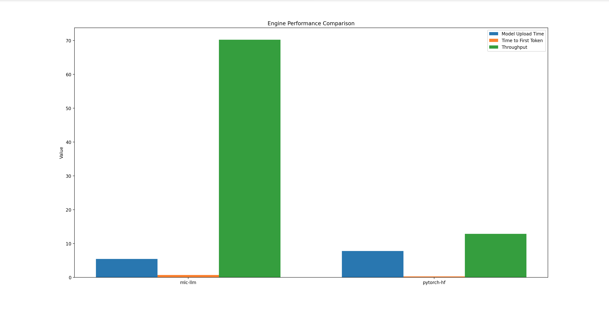
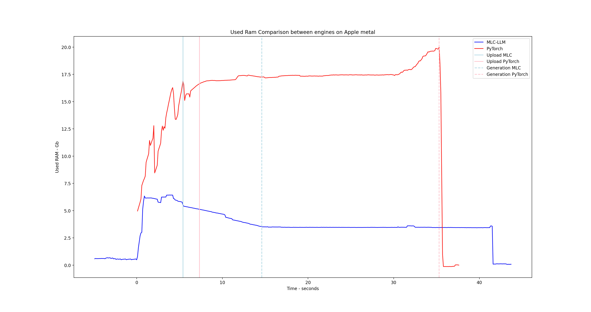

# Speech Memory Assistant
## Project Layout
```
SMA-LL
    LICENSE
    README.md
    env.yaml
    src
        memory_management_scripts
            memory_safety.sh
            run.sh
            terminate_model.sh
        Output --- Temp for Speech to Text to save Voice Recording on RAM
        sma_llm
            __init__.py
            utils
                io_pipeline
                    __init__.py
                    handle_read
                        __init__.py
                        read_global_instance.py
                        read_input_interface.py
                        keyboard.py
                        speech.py
                        speech_to_text
                            __init__.py
                            stt.py
                            utils
                                README.txt
                                rm_tmp.sh
                                tmp.sh
                    handle_write
                        __init__.py
                        write_global_instance.py
                        write_output_interface.py
                        speak_output.py
                        print_output.py
                memory.py
                network
                    network_pytorch_hf.py
                    network_interface.py
                    network_mlc_llm.py
                    __init__.py
                    read_model_config.py
                __init__.py
                text_handler.py
            benchmarking
                __init__.py
                main.py
                results
                utils
                    __init__.py
                    graph.py
                    model_interface.py
                    pytorch_hf.py
                    mlc_llm.py
                scripts
                    get_memory.shcd
            models
                download.py
                models.md
            main
                chat
                    chat_main.py
                    conversation.py
                    __init__.py
                __init__.py
                my_main.py
```
## Project Flow
```
python3 -m sma_llm.main.my_main

my_main -> Initialize a chat -> Upload the "Assistant"'s model
            Conversation()   
                             -> Initialize the chat's memory

        -> Converse -> read, process & autocorrect input
        |           -> update chat memory
        |           -> generate Assistant's answer & live print it
        |           -> process & autocorrect the output
        |           -> update chat memory
        |           -> recursively repeat Converse()---|
        \_Recursive Call_______________________________/
                 
```
## Benchmarking
__MLC-LLM & HF PyTorch__ on Apple Metal


