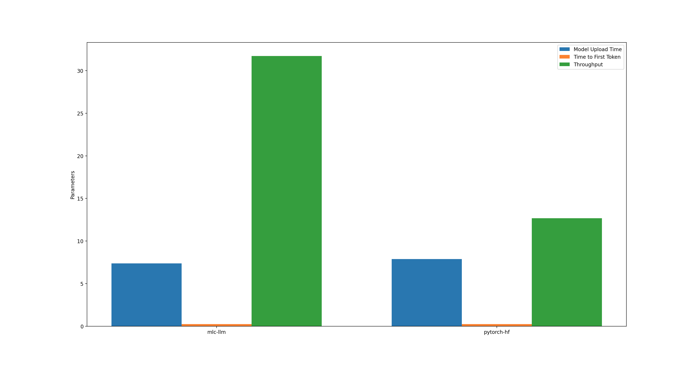
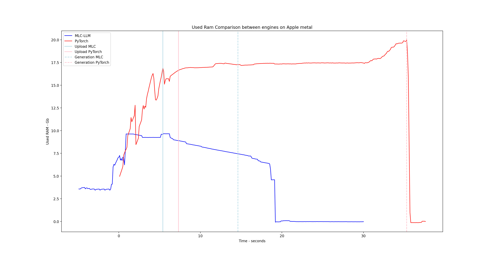

# Speech Memory Assistant
### Full-Stack LLM Chat Assistant: Modular Python Project

Python based project with GUI that integrates unified abstract methods to have open-ended like conversation with different large language models - MLC-LLM | PyTorch - on Apple Silicon.

Fully modular and easily extendable. The project integrates benchmarking, memory handling, text & audio processing, speech to text and text to speech capabilities.

## Benchmarking: MLC-LLM vs PyTorch (with MPS) on Apple Silicon

MLC-LLM proved to be 3 times faster during inference, and also use half as much RAM.

*Note: model used for benchmarking was Hermes-3-Llama-3.2-3B   q0f16*

### Mean values principal parameters:

```
Engine Type | Model Upload Time | Time to First Token | Throughput
------------|-------------------|---------------------|------------
pytorch-hf  | 7.8740            | 0.2473              | 12.7779
mlc-llm     | 7.3667            | 0.2406              | 31.7338
```

*Comparison Model Upload Time, Time to First Token and Throughput, MLC-LLM vs PyTorch*



*RAM usage comparison during upload, inference and termination, MLC-LLM vs PyTorch*



[Measurements main parameters](./Contents/sma_llm/benchmarking/results/principal.txt)

[Measurements RAM MLC](./Contents/sma_llm/benchmarking/results/memory_mlc.cvs)

[Measurements RAM PyTorch](./Contents/sma_llm/benchmarking/results/memory_py.cvs)

## Features

**Benchmarking:** Measures relevant parameters (Model Upload Time, Time to First Token and Throughput, RAM usage) and compare the two frameworks.

**Speech to Text and Text to Speech:** The audio input file is saved onto a small RAM disk volume; keeping it on RAM ensures highest processing speed.

**GUI:** User interfaces that also handle exit signal propagation and handling.

**Bash scripts:** To automate execution, to process termination if RAM usage is too high & to create the RAM Disk Volume.

**Specialized commands:** Export the conversation as PDF & benchmark the current running model (calculate live and display engine type, time to first token, throughput).

**Modularity:** The project follows the OOP principles being structured in many modules, each with  its designated scope.

**Unification:** Interfaces for models, reading input and writing output.

## Project structure

### Relevant Packages and their roles

```
main
    utils logic put together to simulate open-ended conversation
utils
    network
        model interface
    memory.py
        general purpose memory to handle both dictionaries and strings
    io_pipeline
        read and write interfaces
    text_handler.py
        process text
    gui
        GUI and specialized GUI tasks
benchmarking
    scripts to calculate relevant model parameters & draw graphs
```

### Project Flow - Non-GUI

python3 -m sma_llm.main.my_main

```
my_main
  │
  └─> Initialize a chat
        │
        ├─> Upload "Assistant" model
        └─> Initialize chat's memory
        │
        v
      converse()
        │
        └─> Read, Process & Autocorrect input
              │
              └─> Update chat memory
              │
              └─> Generate Assistant's answer & print it live
                    │
                    └─> Process & Autocorrect output
                          │
                          └─> Update chat memory
                                │
                                └─↺ Recursively repeat converse()
```

[Packages, scripts, modules and project architecture further explained here.](./Contents/sma_llm/README_modules_explained.md)

## Requirements

Only requirement: [conda](https://conda.org) to handle the virtual environment.

*note*: The project is meant for systems using Apple Silicon.

## How to run

The whole repository follows the MacOS App bundle, therefore by setting everything up and adding .app in repository name, it becomes executable.

1)  git clone https://github.com/1ul1/sma-llm
2)  in repository root: 

    conda env create -p ../env -f env.yaml

    *note*: I recommend copying the environment outside the repository, so it does not break when adding .app, as it might use absolute paths
3)  a.  **terminal** 

    source conda.sh in current terminal session + conda activate ../env 
    
    cd ./Contents

    python3 -m sma_llm.main.my_main

    b. **App Bundle**

    set up ./Contents/MacOS/execute.sh

    ```
    #!/bin/bash
    path="$(dirname $(realpath $0))"
    cd "$path"
    # ACTIVATE CONDA ENV
    # source /Users/$USER/GenericPathTo/conda.sh
    conda activate ../../env
    cd ..
    python3 sma_llm/utils/gui/wait_screen.py &
    pid=$!
    python3 -m sma_llm.main.my_main $pid
    ``` 
    *source conda.sh* if needed

    *conda activate* line should point towards created environment.

    Now simply executing execute.sh from anywhere should start the project, and adding the .app extension to the repository directory should transform it into a MacOS App.

*Notes*: Models and Tokenizers are not included on github. For the project to run either change the following lines from network_mlc_llm.py or network_pytorch_hf.py to trigger mlc-llm or hf to download the models into cache or download the models and add them in Contents/sma_llm/models, so the following lines of code work:


**mlc-llm**

`cls.model =  "./sma_llm/models/mlc_llm/model"`

**PyTorch**

`cls.model =  LLM.from_pretrained("./sma_llm/models/hf_pytorch/model")`
            
`cls.tokenizer = Tokenizer.from_pretrained("./sma_llm/models/hf_pytorch/tokenizer")`

### Project Layout
```
SMA-LLM
    LICENSE
    README.md
    env.yaml
    Contents
        Info.plist
        Resources
            icon.icns
        MacOS
            execute.sh
        memory_management_scripts
            memory_safety.sh
            run.sh
            terminate_model.sh
        sma_llm
            __init__.py
            main
                chat
                    chat_main.py
                    conversation.py
                    __init__.py
                __init__.py
                my_main.py
            utils
                io_pipeline
                    __init__.py
                    handle_read
                        __init__.py
                        read_global_instance.py
                        read_input_interface.py
                        keyboard.py
                        speech.py
                        speech_to_text
                            __init__.py
                            stt.py
                            utils
                                README.txt
                                rm_tmp.sh
                                tmp.sh
                    handle_write
                        __init__.py
                        write_global_instance.py
                        write_output_interface.py
                        speak_output.py
                        print_output.py
                        write_UI.py
                gui
                    __init__.py
                    frontend.py
                    chat_bubble.py
                    move_event.py
                    resize_event.py
                    read_input.py
                    global_instances.py
                    task_automation.py
                    wait_screen.py
                    task_scripts
                        ChooseWhereToSave.applescript
                        exporting.py
                        benchmarking.py
                network
                    network_pytorch_hf.py
                    network_interface.py
                    network_mlc_llm.py
                    __init__.py
                    read_model_config.py
                __init__.py
                text_handler.py
                memory.py
            benchmarking
                __init__.py
                main.py
                results
                utils
                    __init__.py
                    graph.py
                    model_interface.py
                    pytorch_hf.py
                    mlc_llm.py
                scripts
                    get_memory.sh
            models
                download.py
                models.md
```
